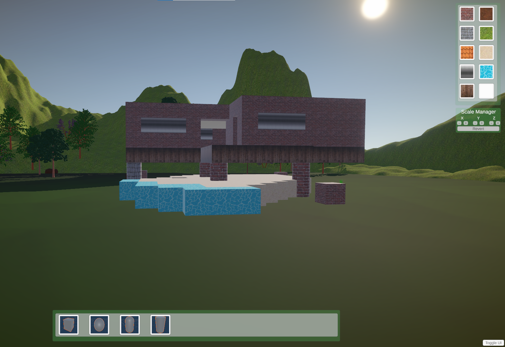
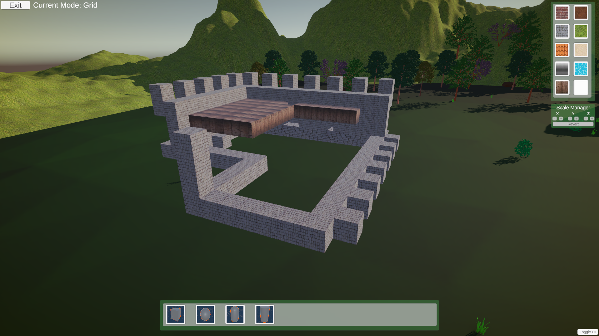
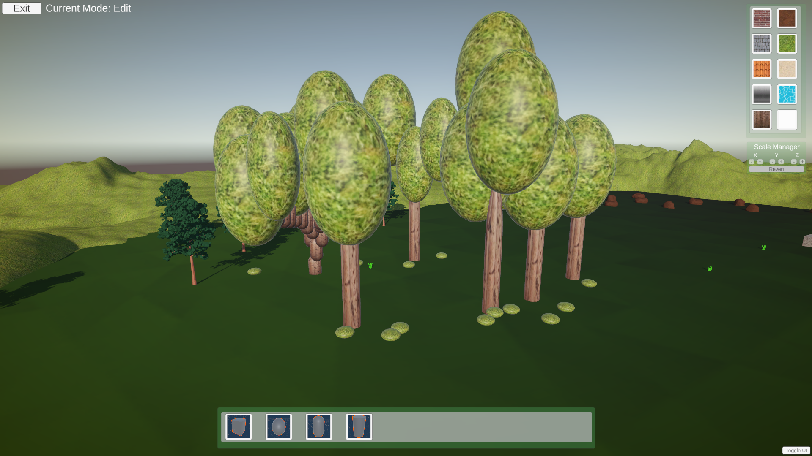

# TA-Building-System
 A small project representing an example building system made in Unity 2022.3.4f1, using URP package as a part of Technical Assessment.

 The project allows for selection of Unity's primitive shapes and their subsequent placement in the game world. The user can freely move the object, rotate it and adjust its texture and scale.
 It has a basic scene loaded for testing purposes.

## Features :wrench:
* Object shape selection
* Texture selection
* Scale Manager
* Freeform placement system
* Grid placement system
* Edit mode

## Controls :video_game:
Basic Camera Movement:
 - WASD for moving around
 - QE for rotating the camera
 - Scrollwheel to control the distance to the ground
 - Holding Scrollwheel button allows to adjust the camera rotation

Building Modes:
 - ESC - Edit mode
 - F - Freeform mode
 - G - Grid Mode

Placement:
 - Left Click to place object
 - Right Click to deselect objects
 - Use [] to rotate objects
 - "/" to Flip objects by 90 degrees

Edit Mode:
 - Left Control + Left Click - Add to the selected objects list
 - Delete - Remove highlighted or all selected objects
 - Use [] to rotate several of objects along their centre

## Mode Guides :grey_question:

In a **Freeform Mode**, there are no restrictions nor snapping of the object placement. The cursor points towards the lower base of an anchor at a set scale of 1f, which works with some of the primitive types. It is useful for scattering various objects/decorations without the need for strict consistency between the objects

The **Grid Mode** allows for placing objects by snapping to the grid position. The grid is 3D, supporting up to 10 cells going in height. In a grid mode, the object placement is being snapped to an appropiate invisible cell.

The **Edit Mode** allows for selecting and editing already placed objects. Hold Left Control and click on different objects to select several of them at the same time. Pressing Delete will remove the object/s depending on which are selected. Highlight can be seen by a yellow tint on the object texture.

## Examples

Screenshots that resulted from playing around with the software for few minutes.

**Example 1:**

**Example 2:**

**Example 3:**

## To Do: :calendar:
Due to the limited time to develop the project, scope of the features was restricted. Future developments of the project could include addition of:
* Drag placement - would allow user to place objects by holding the left mouse button
* Material Selector - would allow to customize the materials of the objects, i.e. more metallic steel or more natural clay.
* Drag Box - would simplify selection by clicking and dragging a box across several elements
* Implementation of Ctrl+C, Ctrl+V - would allow for copying and pasting objects onto a scene
* SFX and VFX
* QA, bug spotting and bug fixing
